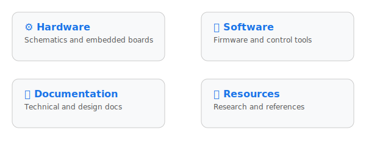

<h1> Project Agent-6502 </h1>

<h2> About the Project </h2>

 
  This project is to create an emulator to replicate the behaviour of the microprocessor 
    <a href="https://en.wikipedia.org/wiki/MOS_Technology_6502">
      MOS-6502
    </a>.

  

